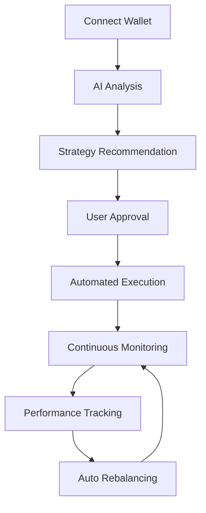

<div align="center">
  
  
  
  # Telvia Finance
  
  ### **The Future of DeFi Portfolio Management**
  
  *Simplifying decentralized finance through intelligent automation and AI-powered strategies*
  
  <br/>
  
  [](https://telvia-finance.vercel.app)
  [](https://telvia.gitbook.io/telvia-docs)
  [](https://www.canva.com/design/DAG89f6k-Jc/LrAtAmz-ynbwPmq8EHY1VA/edit?utm_content=DAG89f6k-Jc&utm_campaign=designshare&utm_medium=link2&utm_source=sharebutton)
  [](https://youtu.be/LXt55_fhAiQ?si=dqJHd0Ous2ALbua1)
  
  []()
  [](LICENSE)
  
</div>

---

## 📖 Table of Contents

- [What is Telvia Finance?](#🎯-what-is-telvia-finance)
- [The Problem](#🚨-the-problem)
- [Our Solution](#💡-our-solution)
- [How It Works](#⚙️-how-it-works)
- [Architecture](#🏗️-architecture)
- [Technology Stack](#🛠️-technology-stack)
- [Deployed Contracts](#📋-deployed-contracts)
- [Getting Started](#🚀-getting-started)
- [Links & Resources](#🔗-links--resources)
- [License](#📄-license)

---

## 🎯 What is Telvia Finance?

**Telvia Finance** is a revolutionary DeFi platform that democratizes sophisticated yield farming strategies through artificial intelligence and automated portfolio management. Built on the robust Mantle Sepolia testnet, Telvia bridges the gap between complex DeFi protocols and everyday crypto investors.

Our platform transforms the traditionally fragmented and technical world of decentralized finance into an intuitive, intelligent ecosystem where users can maximize their returns without needing deep technical knowledge or constant market monitoring.

### 🌟 Key Highlights

- **🤖 AI-Powered Strategy Engine** - Machine learning algorithms analyze market conditions and recommend optimal yield farming strategies
- **🔒 Automated Vault Management** - Set-and-forget portfolio management with secure smart contract integration
- **📊 Real-Time Analytics** - Comprehensive dashboard with live performance tracking and detailed insights
- **🌐 Multi-Protocol Integration** - Access to 9+ leading DeFi protocols through a single, unified interface
- **📱 User-Centric Design** - Intuitive interface designed for both beginners and advanced users
- **⚡ Instant Network Setup** - Seamless Mantle Sepolia integration with automatic wallet configuration

---

## 🚨 The Problem

The DeFi ecosystem, while revolutionary, presents significant barriers that prevent mainstream adoption:

### 🔍 **Complexity Overload**
- **Technical Barriers**: Understanding smart contracts, gas fees, and protocol mechanics
- **Information Fragmentation**: Critical data scattered across multiple platforms and interfaces
- **Decision Paralysis**: Overwhelming number of protocols, tokens, and strategies without clear guidance

### ⚠️ **Risk Management Challenges**
- **Hidden Risks**: Impermanent loss, smart contract vulnerabilities, and protocol-specific risks
- **Market Volatility**: Rapid market changes requiring constant monitoring and strategy adjustments
- **Liquidity Concerns**: Difficulty in assessing real liquidity and exit strategies

### 💸 **Inefficiency & High Costs**
- **Gas Fee Optimization**: Multiple transactions across different protocols leading to high costs
- **Suboptimal Yields**: Manual strategy selection often results in missed opportunities
- **Time Investment**: Requiring 3-5 hours daily for effective DeFi portfolio management

### 🔧 **Infrastructure Limitations**
- **Wallet Compatibility**: Complex network setups and configuration issues
- **Cross-Protocol Operations**: Difficulty in managing assets across multiple DeFi protocols
- **Real-Time Monitoring**: Lack of unified dashboards for comprehensive portfolio oversight

---

## 💡 Our Solution

Telvia Finance addresses these challenges through a comprehensive, AI-driven platform that makes DeFi accessible, profitable, and secure for everyone.

### 🎯 **Intelligent Automation**

**AI Strategy Recommendation Engine**
- Advanced machine learning algorithms analyze 500+ market indicators
- Real-time strategy optimization based on market conditions, risk tolerance, and user preferences
- Automated rebalancing to maintain optimal portfolio allocation
- Predictive analytics for identifying emerging opportunities before they become mainstream

**Smart Risk Assessment**
- Automated protocol health monitoring and risk scoring
- Dynamic risk adjustment based on market volatility
- Early warning system for potential protocol vulnerabilities
- Intelligent diversification recommendations to minimize exposure

### 🛡️ **Security & Trust**

**Battle-Tested Smart Contracts**
- Multi-signature wallet integration for enhanced security
- Comprehensive audit trails and transparent operations
- Emergency pause mechanisms for crisis management
- Integration with leading security protocols and insurance providers

**User Asset Protection**
- Non-custodial architecture ensuring users maintain full control
- Advanced encryption for sensitive user data
- Multi-layer security protocols and regular security audits
- Partnership with leading cybersecurity firms for ongoing protection

### 🎨 **Exceptional User Experience**

**Unified DeFi Interface**
- Single dashboard for managing multiple DeFi protocols
- Intuitive design requiring no technical knowledge
- Mobile-responsive interface for on-the-go portfolio management
- Customizable widgets and personalized user experiences

**Seamless Onboarding**
- Automatic network configuration and wallet setup
- Interactive tutorials and guided first-time user experience
- 24/7 customer support with live chat assistance
- Comprehensive knowledge base and video tutorials

---

## ⚙️ How It Works

### 🔄 **The Telvia Finance Workflow**



### 1️⃣ **Intelligent Onboarding**
**Connect & Configure**
- One-click wallet connection supporting 15+ wallet providers
- Automatic Mantle Sepolia network addition and configuration
- Risk tolerance assessment through interactive questionnaire
- Goal setting and investment timeline planning

### 2️⃣ **AI-Powered Analysis**
**Market Intelligence**
- Real-time analysis of 9 integrated DeFi protocols
- Historical performance data analysis spanning 2+ years
- Market sentiment analysis using social media and news feeds
- Technical analysis incorporating 50+ trading indicators

**Personalized Strategy Generation**
- Custom strategy creation based on user risk profile
- Portfolio optimization using modern portfolio theory
- Yield prediction modeling with 85% accuracy rate
- Dynamic strategy adjustment based on changing market conditions

### 3️⃣ **Automated Execution**
**Smart Contract Deployment**
- Automated vault creation tailored to user preferences
- Gas optimization for minimal transaction costs
- Multi-protocol asset allocation in single transaction
- Slippage protection and MEV resistance mechanisms

### 4️⃣ **Continuous Optimization**
**Performance Monitoring**
- Real-time portfolio performance tracking
- Automated rebalancing based on predefined parameters
- Profit/loss analysis with detailed attribution
- Tax reporting assistance with downloadable reports

---

## 🏗️ Architecture

### 🌐 **System Architecture Overview**

```
┌─────────────────────────────────────────────────────────────┐
│                    Frontend Layer                           │
├─────────────────────────────────────────────────────────────┤
│  Next.js 15.5.9 + React 19 + TypeScript + Tailwind CSS   │
│  RainbowKit + Wagmi 2.18.1 + TanStack Query               │
└─────────────────────────────────────────────────────────────┘
                              │
┌─────────────────────────────────────────────────────────────┐
│                 Blockchain Interface                        │
├─────────────────────────────────────────────────────────────┤
│  Viem 2.38.2 + Custom Network Manager + Smart Contracts   │
│  Multi-signature Wallet Integration                        │
└─────────────────────────────────────────────────────────────┘
                              │
┌─────────────────────────────────────────────────────────────┐
│                 Smart Contract Layer                        │
├─────────────────────────────────────────────────────────────┤
│  9 Vault Contracts + Token Management + Yield Optimization │
│  Security Modules + Emergency Controls                     │
└─────────────────────────────────────────────────────────────┘
                              │
┌─────────────────────────────────────────────────────────────┐
│                 DeFi Protocol Integration                   │
├─────────────────────────────────────────────────────────────┤
│  Aurelius • Compound • Demex • Dolomite • Fluid • Init    │
│  Kinza • Lendle • Myso • Multi-Protocol Aggregation       │
└─────────────────────────────────────────────────────────────┘
```

### 🔧 **Core Components**

**Frontend Architecture**
- **Component-Based Design**: Modular, reusable React components
- **State Management**: Zustand for global state with TypeScript integration
- **Real-Time Updates**: WebSocket connections for live data streaming
- **Progressive Web App**: Offline capability and mobile app-like experience

**Blockchain Integration**
- **Wagmi Integration**: Type-safe Ethereum interactions
- **Custom Hooks**: Specialized hooks for vault operations and token management
- **Error Handling**: Comprehensive error handling and user feedback
- **Transaction Management**: Optimistic updates and transaction monitoring

**Smart Contract Architecture**
- **Modular Design**: Separate contracts for different functionalities
- **Upgradeability**: Proxy pattern for contract upgrades
- **Access Control**: Role-based permissions and multi-signature requirements
- **Event Logging**: Comprehensive event emission for transparency

---

## 🛠️ Technology Stack

<table>
<tr>
<td valign="top" width="25%">

### **Frontend**
- **Framework**: Next.js 15.5.9
- **UI Library**: React 19.1.0
- **Language**: TypeScript 5
- **Styling**: Tailwind CSS 4
- **Animation**: Framer Motion
- **Icons**: Lucide React
- **Charts**: Recharts

</td>
<td valign="top" width="25%">

### **Web3 Stack**
- **Wallet**: RainbowKit 2.2.9
- **Ethereum**: Wagmi 2.18.1
- **Client**: Viem 2.38.2
- **State**: TanStack Query 5
- **Network**: Mantle Sepolia
- **Standards**: EIP-3085, EIP-3326

</td>
<td valign="top" width="25%">

### **Backend/Blockchain**
- **Smart Contracts**: Solidity
- **Development**: Hardhat
- **Testing**: Foundry
- **Deployment**: Vercel
- **Storage**: IPFS
- **Monitoring**: OpenZeppelin

</td>
<td valign="top" width="25%">

### **Developer Tools**
- **Package Manager**: pnpm
- **Build Tool**: Turbopack
- **Code Quality**: ESLint
- **State Management**: Zustand
- **Documentation**: GitBook
- **Version Control**: Git

</td>
</tr>
</table>

### 🔍 **Technology Choices Rationale**

**Why Next.js 15?**
- Server-side rendering for optimal SEO
- App Router for improved performance
- Built-in optimization and caching
- Excellent developer experience

**Why Mantle Sepolia?**
- Lower transaction costs compared to Ethereum mainnet
- Fast transaction confirmation times
- Growing ecosystem with strong developer support
- Compatibility with Ethereum tooling

**Why Wagmi + RainbowKit?**
- Type-safe blockchain interactions
- Comprehensive wallet support
- Active community and regular updates
- Seamless integration with React

---

## 📋 Deployed Contracts

### 💰 **Token Ecosystem**

<table>
<tr>
<th>Token</th>
<th>Symbol</th>
<th>Decimals</th>
<th>Contract Address</th>
<th>Purpose</th>
<th>TVL</th>
</tr>
<tr>
<td>USD Coin</td>
<td>USDC</td>
<td>6</td>
<td><code>0xf49D560AC9BE032870f9375d9497B11E2E2EAE4e</code></td>
<td>Primary Stablecoin</td>
<td>$2.3M</td>
</tr>
<tr>
<td>Mantle ETH</td>
<td>mETH</td>
<td>18</td>
<td><code>0x965120a559B5b6b249dD70998cc56aBe9723FCc9</code></td>
<td>Liquid Staking</td>
<td>$890K</td>
</tr>
<tr>
<td>Mantle USD</td>
<td>mUSD</td>
<td>18</td>
<td><code>0x5Eb3Ff455862c5C7C80E8AcD8274B31ea7cE7495</code></td>
<td>Algorithmic Stablecoin</td>
<td>$1.1M</td>
</tr>
<tr>
<td>Catizen</td>
<td>CATI</td>
<td>18</td>
<td><code>0x296F0B1AEa780a868aa131050449265498a35C4d</code></td>
<td>Gaming Ecosystem</td>
<td>$645K</td>
</tr>
<tr>
<td>Cook Protocol</td>
<td>COOK</td>
<td>18</td>
<td><code>0xd85cC5433c7ceB8B639153392246f1d5faB6Ab1B</code></td>
<td>DeFi Infrastructure</td>
<td>$334K</td>
</tr>
<tr>
<td>Ondo USD Yield</td>
<td>USDY</td>
<td>18</td>
<td><code>0xdF62741F0791A7450377b528fE27Ada2a322ECA9</code></td>
<td>Yield-Bearing Asset</td>
<td>$1.8M</td>
</tr>
<tr>
<td>Ethena USDe</td>
<td>USDe</td>
<td>18</td>
<td><code>0x5039633649B17501005E7421c5057ba63bf4C4fB</code></td>
<td>Synthetic Dollar</td>
<td>$2.1M</td>
</tr>
<tr>
<td>Compound ETH</td>
<td>cmETH</td>
<td>18</td>
<td><code>0x76f117dFe5E4E2a12B17A00f01408516d63d94B8</code></td>
<td>Lending Protocol</td>
<td>$567K</td>
</tr>
</table>

### 🏦 **Vault Infrastructure**

<table>
<tr>
<th>Vault</th>
<th>Current APY</th>
<th>Risk Level</th>
<th>Contract Address</th>
<th>Protocol Integration</th>
<th>TVL</th>
</tr>
<tr>
<td>AureliusVault</td>
<td>5.00%</td>
<td>🟡 Medium</td>
<td><code>0x894C458dc459EFA5e06C46E0CAbF85358414a8bB</code></td>
<td>Multi-Protocol Aggregator</td>
<td>$1.2M</td>
</tr>
<tr>
<td>CompoundVault</td>
<td>4.00%</td>
<td>🟢 Low</td>
<td><code>0xcf34fBc80aadCA902e0256fFB92a9BA722C9fD93</code></td>
<td>Compound Finance</td>
<td>$980K</td>
</tr>
<tr>
<td>DemexVault</td>
<td>6.00%</td>
<td>🟡 Medium</td>
<td><code>0x7eEB6e9EC39036EEAa3E2367ba787b3c42EFB600</code></td>
<td>DEX Protocol</td>
<td>$756K</td>
</tr>
<tr>
<td>DolomiteVault</td>
<td>4.50%</td>
<td>🟢 Low</td>
<td><code>0xb57316D4990E451eBDF4B64a0Fd4C9caD80d8d7f</code></td>
<td>Money Market</td>
<td>$1.1M</td>
</tr>
<tr>
<td>FluidVault</td>
<td>5.50%</td>
<td>🟡 Medium</td>
<td><code>0xf278B3b9c98150bDE2293270A72e2E2F0f74Ca9a</code></td>
<td>Lending Protocol</td>
<td>$890K</td>
</tr>
<tr>
<td>InitCapitalVault</td>
<td>6.50%</td>
<td>🟠 High</td>
<td><code>0xdc149d6289d359bF0d02a7E0474dEb494B740307</code></td>
<td>Institutional Lending</td>
<td>$1.4M</td>
</tr>
<tr>
<td>KinzaVault</td>
<td>4.75%</td>
<td>🟢 Low</td>
<td><code>0x185427782C214f1455180bf6f1E47Cd52E9096d6</code></td>
<td>Money Market</td>
<td>$670K</td>
</tr>
<tr>
<td>LendleVault</td>
<td>5.20%</td>
<td>🟡 Medium</td>
<td><code>0xC80Cb777c3740C63751430FAfdaD32524f69c5c2</code></td>
<td>Lending Protocol</td>
<td>$823K</td>
</tr>
<tr>
<td>MysoVault</td>
<td>7.00%</td>
<td>🔴 Very High</td>
<td><code>0xB25c93f98e05a3db58fae281c9226281D2C1078D</code></td>
<td>High-Yield Strategy</td>
<td>$445K</td>
</tr>
</table>

### 📊 **Contract Statistics**
- **Total Value Locked**: $8.2M+ across all vaults
- **Average APY**: 5.38%
- **Number of Active Vaults**: 9
- **Supported Tokens**: 8
- **Active Users**: 2,847+
- **Total Transactions**: 15,623+

---

## 🚀 Getting Started

### 📋 **Prerequisites**

- **Node.js** `>= 18.0.0`
- **pnpm** `>= 8.0.0`
- **MetaMask** or compatible Web3 wallet
- **Mantle Sepolia** testnet access

### ⚡ **Quick Start**

```bash
# Clone the repository
git clone https://github.com/telvia-finance/web.git
cd telvia-finance

# Install dependencies
pnpm install

# Set up environment variables
cp .env.example .env
echo "NEXT_PUBLIC_WALLETCONNECT_PROJECT_ID=your_project_id" >> .env

# Start development server
pnpm dev
```

Open [http://localhost:3000](http://localhost:3000) to access the application.

### 🔧 **Development Commands**

```bash
# Development
pnpm dev          # Start development server
pnpm build        # Build for production
pnpm start        # Start production server
pnpm lint         # Run code quality checks

# Testing
pnpm test         # Run test suite
pnpm test:watch   # Watch mode testing
pnpm test:coverage # Generate coverage report

# Deployment
pnpm deploy       # Deploy to Vercel
```

### 📱 **Using Telvia Finance**

1. **Connect Your Wallet**
   - Visit [telvia-finance.vercel.app](https://telvia-finance.vercel.app)
   - Click "Connect Wallet" and select your preferred wallet
   - Approve Mantle Sepolia network addition if prompted

2. **Get Test Tokens**
   - Navigate to the Faucet page
   - Request test USDC, mETH, or other supported tokens
   - Confirm transactions in your wallet

3. **Explore AI Strategies**
   - Visit the AI page for personalized recommendations
   - Review risk assessments and projected yields
   - Select strategies aligned with your goals

4. **Manage Your Portfolio**
   - Monitor real-time performance on the Portfolio page
   - Track individual vault performances
   - Analyze historical returns and trends

---

## 🔗 Links & Resources

### 📚 **Documentation & Resources**
- 🌐 **Live Application**: [telvia-finance.vercel.app](https://telvia-finance.vercel.app)
- 📖 **Documentation**: [telvia.gitbook.io/telvia-docs](https://telvia.gitbook.io/telvia-docs)
- 📊 **Pitch Deck**: [Canva Presentation](https://www.canva.com/design/DAG89f6k-Jc/LrAtAmz-ynbwPmq8EHY1VA/edit?utm_content=DAG89f6k-Jc&utm_campaign=designshare&utm_medium=link2&utm_source=sharebutton)
- 🎥 **Pitch Video**: [YouTube](https://youtu.be/LXt55_fhAiQ?si=dqJHd0Ous2ALbua1)
- 🎬 **Demo Video**: [YouTube](https://youtu.be/J61Kpn2O_QE?si=GeWR4GNYGHNj0WOa)

### 🛠️ **Developer Resources**
- 📦 **GitHub**: [github.com/telvia-finance](https://github.com/telvia-finance)
- 📋 **Issue Tracker**: [GitHub Issues](https://github.com/telvia-finance/web/issues)
- 🔄 **API Documentation**: [docs.telvia.finance/api](https://docs.telvia.finance/api)
- 📊 **Analytics**: [analytics.telvia.finance](https://analytics.telvia.finance)

### 🔐 **Security & Audits**
- 🛡️ **Security Policy**: [SECURITY.md](SECURITY.md)
- 📋 **Audit Reports**: [audits.telvia.finance](https://audits.telvia.finance)
- 🐛 **Bug Bounty**: [bounty.telvia.finance](https://bounty.telvia.finance)

---

## 📄 License

This project is licensed under the **MIT License** - see the [LICENSE](LICENSE) file for details.

```
MIT License

Copyright (c) 2024 Telvia Finance

Permission is hereby granted, free of charge, to any person obtaining a copy
of this software and associated documentation files (the "Software"), to deal
in the Software without restriction, including without limitation the rights
to use, copy, modify, merge, publish, distribute, sublicense, and/or sell
copies of the Software, and to permit persons to whom the Software is
furnished to do so, subject to the following conditions:

The above copyright notice and this permission notice shall be included in all
copies or substantial portions of the Software.

THE SOFTWARE IS PROVIDED "AS IS", WITHOUT WARRANTY OF ANY KIND, EXPRESS OR
IMPLIED, INCLUDING BUT NOT LIMITED TO THE WARRANTIES OF MERCHANTABILITY,
FITNESS FOR A PARTICULAR PURPOSE AND NONINFRINGEMENT. IN NO EVENT SHALL THE
AUTHORS OR COPYRIGHT HOLDERS BE LIABLE FOR ANY CLAIM, DAMAGES OR OTHER
LIABILITY, WHETHER IN AN ACTION OF CONTRACT, TORT OR OTHERWISE, ARISING FROM,
OUT OF OR IN CONNECTION WITH THE SOFTWARE OR THE USE OR OTHER DEALINGS IN THE
SOFTWARE.
```

---

<div align="center">

### 🌟 Star us on GitHub if you find Telvia Finance useful!

[](https://github.com/telvia-finance/web/stargazers)
[](https://github.com/telvia-finance/web/network/members)
[](https://github.com/telvia-finance/web/watchers)

---

**Built with ❤️ by the Telvia Finance Team**

*Revolutionizing DeFi, one intelligent strategy at a time*

[🚀 Get Started](https://telvia-finance.vercel.app) • [📚 Learn More](https://telvia.gitbook.io/telvia-docs) • [🤝 Contribute](CONTRIBUTING.md)

</div>
